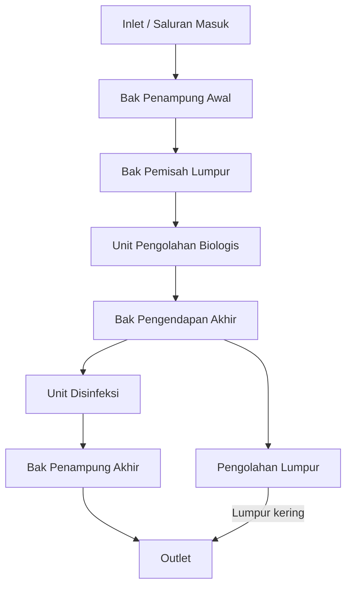
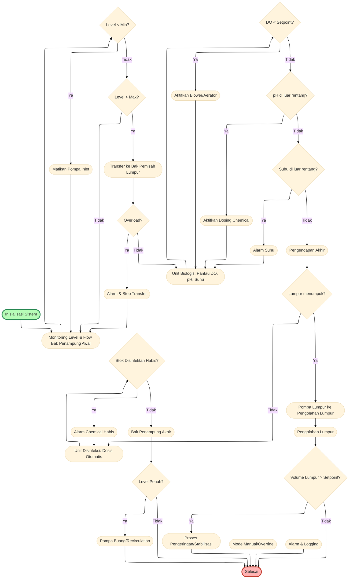

# Rencana Instalasi Pengolahan Air Limbah (IPAL)

## 1. Tujuan
Mendesain sistem IPAL untuk mengolah air limbah domestik/industri agar memenuhi baku mutu lingkungan.

## 2. Komponen Utama IPAL

1. **Saluran Masuk (Inlet)**
   - Mengalirkan air limbah ke unit IPAL.

2. **Bak Penampung Awal (Equalization Tank)**
   - Menampung dan menyeimbangkan debit serta kualitas air limbah.

3. **Bak Pemisah Lumpur (Primary Sedimentation Tank)**
   - Mengendapkan partikel padat kasar.

4. **Unit Pengolahan Biologis (Aerasi/Biofilter)**
   - Menguraikan bahan organik menggunakan mikroorganisme.

5. **Bak Pengendapan Akhir (Secondary Clarifier)**
   - Mengendapkan lumpur hasil proses biologis.

6. **Unit Disinfeksi (Chlorination/UV)**
   - Membunuh mikroorganisme patogen.

7. **Bak Penampung Akhir (Effluent Tank)**
   - Menampung air hasil olahan sebelum dibuang atau digunakan kembali.

8. **Pengolahan Lumpur (Sludge Treatment)**
   - Mengeringkan dan menstabilkan lumpur hasil pengolahan.

## 2a. Parameter Desain IPAL

1. Kapasitas debit air limbah (Q, m³/hari)
2. Kualitas air limbah masuk (BOD, COD, TSS, pH, minyak & lemak, amonia, dll)
3. Target kualitas air keluar (mengacu baku mutu lingkungan)
4. Waktu tinggal (Hydraulic Retention Time/HRT) di tiap unit (jam)
5. Volume dan dimensi tiap unit pengolahan (m³, m²)
6. Beban organik (Organic Loading Rate, OLR)
7. Dosis dan jenis disinfektan (chlorine, UV, dll)
8. Sistem dan kapasitas pengolahan lumpur (Sludge Volume Index, SVI)
9. Material konstruksi unit (beton, plastik, baja, dll)
10. Kebutuhan lahan (m²)
11. Sistem kontrol dan pemantauan (otomatis/manual)
12. Kebutuhan energi listrik (kWh)
13. Frekuensi perawatan dan pengurasan
14. Suhu operasi (°C)
15. Kebutuhan aerasi (jika menggunakan proses aerob)

## 3. Alur Proses

1. Air limbah masuk ke bak penampung awal.
2. Mengalir ke bak pemisah lumpur untuk mengendapkan partikel kasar.
3. Masuk ke unit pengolahan biologis untuk penguraian zat organik.
4. Air mengalir ke bak pengendapan akhir.
5. Setelah itu, air didisinfeksi.
6. Air olahan ditampung di bak akhir, siap dibuang atau digunakan ulang.
7. Lumpur dari proses pengendapan diolah lebih lanjut.

## 4. Catatan Desain

- Kapasitas IPAL disesuaikan dengan jumlah limbah harian.
- Sistem dapat berupa konvensional (kolam) atau kompak (modular).
- Perhatikan akses perawatan dan keamanan lingkungan.

## 5. Skema Sederhana

```
Inlet → Bak Penampung → Bak Pemisah Lumpur → Unit Biologis → Bak Pengendapan Akhir → Disinfeksi → Bak Akhir → Outlet
```

## 5a. Diagram Alir Algoritma IPAL



## 5b. Diagram Alir Algoritma Kendali Sistem IPAL



## 6. Referensi

- SNI 19-2453-2002 tentang Tata Cara Perencanaan Teknik IPAL Domestik
- Peraturan Menteri Lingkungan Hidup No. 68 Tahun 2016
